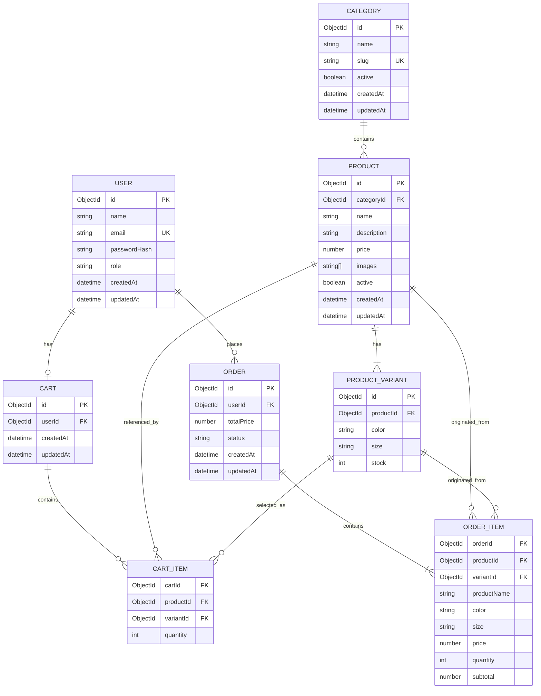

```mermaid
erDiagram
    USER ||--o| CART : has
    USER ||--o{ ORDER : places
    CATEGORY ||--o{ PRODUCT : contains
    PRODUCT ||--|{ PRODUCT_VARIANT : has
    CART ||--o{ CART_ITEM : contains
    PRODUCT ||--o{ CART_ITEM : referenced_by
    PRODUCT_VARIANT ||--o{ CART_ITEM : selected_as
    ORDER ||--|{ ORDER_ITEM : contains
    PRODUCT ||--o{ ORDER_ITEM : originated_from
    PRODUCT_VARIANT ||--o{ ORDER_ITEM : originated_from

    USER {
        ObjectId id PK
        string name
        string email UK
        string passwordHash
        string role
        datetime createdAt
        datetime updatedAt
    }

    CATEGORY {
        ObjectId id PK
        string name
        string slug UK
        boolean active
        datetime createdAt
        datetime updatedAt
    }

    PRODUCT {
        ObjectId id PK
        ObjectId categoryId FK
        string name
        string description
        number price
        string[] images
        boolean active
        datetime createdAt
        datetime updatedAt
    }

    PRODUCT_VARIANT {
        ObjectId id PK
        ObjectId productId FK
        string color
        string size
        int stock
    }

    CART {
        ObjectId id PK
        ObjectId userId FK
        datetime createdAt
        datetime updatedAt
    }

    CART_ITEM {
        ObjectId cartId FK
        ObjectId productId FK
        ObjectId variantId FK
        int quantity
    }

    ORDER {
        ObjectId id PK
        ObjectId userId FK
        number totalPrice
        string status
        datetime createdAt
        datetime updatedAt
    }

    ORDER_ITEM {
        ObjectId orderId FK
        ObjectId productId FK
        ObjectId variantId FK
        string productName
        string color
        string size
        number price
        int quantity
        number subtotal
    }
```
